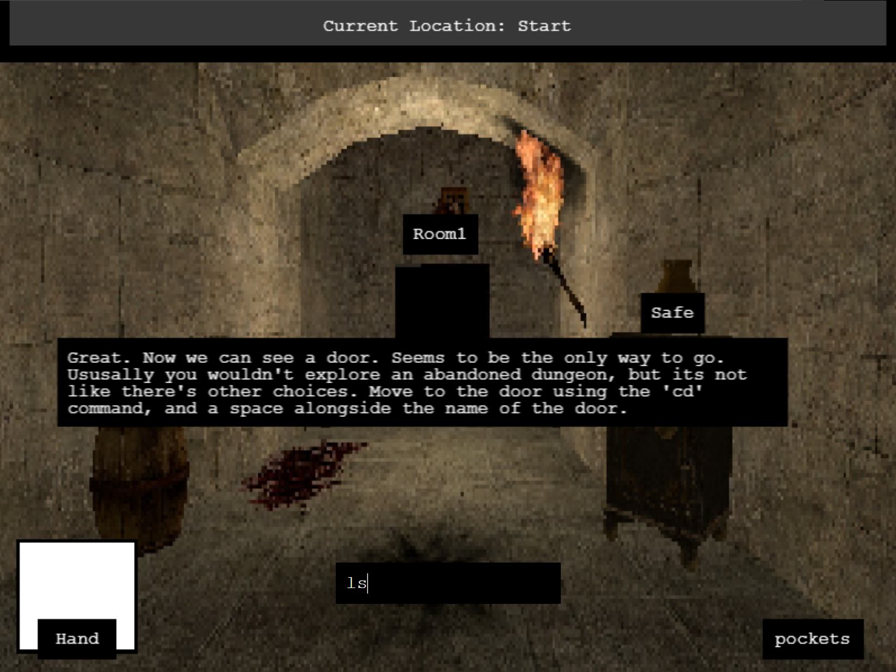

# Game Name

Command The Dungeon!

# Team Color

Yellow

# Developers

- Jeremias Brana Tonelli (jerebt@udel.edu)
- Matthew Goldstein (themattg@udel.edu)

# Blurb

Command the Dungeon! is a game inspired by the old 90's dungeon crawler and old text-based adventure games, where the player needs to escape by searching the rooms and finding keys to open doors, until they get to the final door, for which they will need to search for 4 masks hidden across the map to open it. Instead of traditional movement, players will use basic console commands; specifically, cd, md, and ls; from the command console to move around, to interact with objects and non-playable characters, to access their inventory, and to investigate the room they are currently in. 

# Basic Instructions

Player will need to input commands in the text-box at the bottom of the screen to interact with the world.
Commands:
  - cd + "name": This command will allow the player to move between rooms, check notes, open the inventory (pockets), and talk to the NPCs. Can only be used on the black squares.
  - mv + "item name" + "location": This command will allow the player to interact with items in blue boxes. By typing the name of the item, they can either put it in thier pockets
    (doing mv "item name" + "pockets") when first found, or to their hand while being inside the pockets (doing mv "item name" + "Hand").
  - ls: This command will allow the player to see what all the interactable things the room has, from notes, other rooms, NPCs, or items.
  - ls -a: Achieved after talking to the skeleton, this command will act like the regular ls command, with the difference that this one will also show hidden items that ls doesn't show.
    It is specially used for finding the masks required for the final door.

# Screenshot

# Gameplay Video

https://drive.google.com/file/d/18-5KxwMFCHGuIbBY3FeQKU3FOd5pFM2I/view?usp=drive_link

# Educational Game Design Document

https://github.com/chimuelo1011/Command-The-Dungeon-EGDD.git

# Credits
  - NPCs:
    - Dark Cloak Character Model: [Death: A Grim Bundle [PMs]](https://steamcommunity.com/sharedfiles/filedetails/?id=1380429026)
    - Talking Skeleton Model: [Skeletons](https://steamcommunity.com/sharedfiles/filedetails/?id=2998167453)
    - Talking Mask Model: [Wooden Masks](https://steamcommunity.com/sharedfiles/filedetails/?id=1536572511)
  - Background walls and doors: [gm_buildyourdungeon](https://steamcommunity.com/sharedfiles/filedetails/?id=2795639766)
  - Decoration Models:
      - Bookshelfs: [Bookshelf 1](https://steamcommunity.com/sharedfiles/filedetails/?id=574318643)
      - Carpet: [Carpet Prop](https://steamcommunity.com/sharedfiles/filedetails/?id=3109446454)
      - Weapons: [Immersive Medieval Weapons](https://steamcommunity.com/sharedfiles/filedetails/?id=3259430046)
      - Shields: [Medieval Shields | Models](https://steamcommunity.com/sharedfiles/filedetails/?id=2958443027)
      - Helmets: [Fantasy RP Armor Items](https://steamcommunity.com/sharedfiles/filedetails/?id=423640859)
      - Furniture, notes, and Keys: [Skyrim Furniture Pack](https://steamcommunity.com/sharedfiles/filedetails/?id=2582158815) and [Medieval Content Pack 1](https://steamcommunity.com/sharedfiles/filedetails/?id=754059901)
      - Lanterns: [Cozy Lanterns](https://steamcommunity.com/sharedfiles/filedetails/?id=3324707020)
      - Golden Key: [Key](https://steamcommunity.com/sharedfiles/filedetails/?id=248051620)
      - Safe: [Safe Model](https://steamcommunity.com/sharedfiles/filedetails/?id=2511125493)
  - Put together in: [Garry's Mod](https://store.steampowered.com/app/4000/Garrys_Mod?snr=1_7_15__13)

  - Dialogues' Sound: [bfxr](https://www.bfxr.net/)
  - Image of Dr Bart: [Dr Bart](https://www.cis.udel.edu/nitropack_static/ZRSPRogOEHpIjFdcGyxvriKWeegnLhto/assets/images/optimized/rev-bb67ab1/www.cis.udel.edu/wp-content/uploads/2023/08/Bart-1.jpg)
